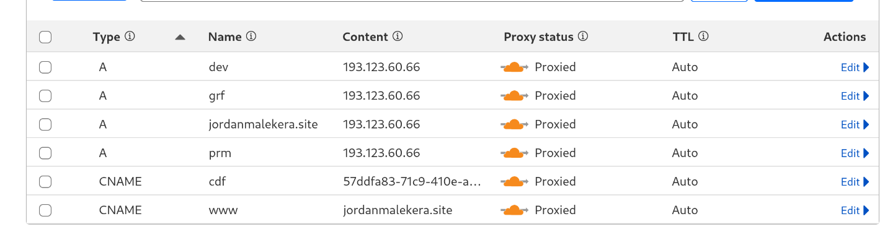

# Docker & Cloud Computing assignment
## Prerequisites
- Docker
- A MERN stack app (ex. [taskfyer](https://github.com/Maclinz/taskfyer)

## Structure
The file structure looks like this
```shell
.
├── /backend
├── /frontend
```

## Docker
### Prerequisites
- Docker (desktop)

### Setup
1. Navigate to your frontend directory
2. Create a Dockerfile
```Dockerfile
# Builder stage
FROM node:21-alpine AS builder

WORKDIR /app

COPY package.json package-lock.json ./

RUN npm install

COPY . .

RUN npm run build

# Production stage
FROM node:21-alpine AS production

WORKDIR /app

COPY --from=builder /app/.next ./.next

COPY --from=builder /app/public ./public

COPY --from=builder /app/package.json ./package.json

RUN npm install next

CMD ["npm", "start"]
```
3. Create a .dockerignore file
```shell
# Node modules and npm debug logs
node_modules
npm-debug.log
yarn-error.log
.pnpm-debug.log

# Environment files
*.env
.env*

# Build outputs
.next
out
dist

# Editor-specific files
.vscode
.idea
.DS_Store
*.swp
*.swo

# Docker files
Dockerfile
docker-compose.yml

# Git-related files
.git
.gitignore

# Logs
logs
*.log
```
4. Do the same for the backend
5. Create a Dockerfile
```Dockerfile
# Base stage
FROM node:18-alpine AS base

WORKDIR /app

COPY package.json package-lock.json ./

RUN npm install

COPY . .

# Production stage
FROM base AS production

RUN npm install --production

CMD ["npm", "start"]
```
6. Create a .dockerignore file
```shell
# Node modules and npm logs
node_modules
npm-debug.log
yarn-error.log
.pnpm-debug.log

# Environment files
*.env
.env*

# Build outputs
dist
build

# Logs
logs
*.log

# Editor-specific files
.vscode
.idea
.DS_Store
*.swp
*.swo

# Docker files
Dockerfile
docker-compose.yml

# Git-related files
.git
.gitignore

# Temporary files
*.tmp
*.bak
```
### Docker Compose
1. Make a new docker directory in the root directory
```shell
.
├── /backend
├── /frontend
├── /docker
```
2. In the docker directory, create a docker-compose.yml file
```yaml
name: taskfyer

services:
  frontend:
    build:
      context: ../frontend
      target: production
    env_file: ../frontend/prod.env
    environment:
      - NEXT_PUBLIC_API_URL=http://localhost/api/v1
    depends_on:
      - backend
    networks:
      - taskfyer_network

  backend:
    build:
      context: ../backend
      target: production
    env_file: ../backend/prod.env
    environment:
      - CLIENT_URL=http://localhost
    depends_on:
      - mongodb
    networks:
      - taskfyer_network

  mongodb:
    image: mongo
    container_name: mongodb
    volumes:
      - mongodb_data:/data/db
    networks:
      - taskfyer_network

volumes:
  mongodb_data:

networks:
  taskfyer_network:
    driver: bridge
```

>[!IMPORTANT]
>Both the frontend and backend use an env file to set their environment variables.

Now the folder structure should somewhat look like this
```shell
.
├── /backend
│   └── prod.env
│   └── Dockerfile
│   └── .dockerignore
│   └── ...
├── /frontend
│   └── prod.env
│   └── Dockerfile
│   └── .dockerignore
│   └── ...
├── /docker
│   └── docker-compose.yml
```
Now we will use nginx to serve the frontend and backend
### Nginx
1. create a new nginx directory in the root directory
```shell
.
├── /backend
├── /frontend
├── /docker
├── /nginx
```
2. In the nginx directory, create a nginx.conf file
>[!IMPORTANT]
> use the docker-compose.yml file to get the names of the containers
```nginx
server {
    listen 80;
    server_name localhost;

    location / {
        proxy_pass http://frontend:3000;
        proxy_set_header Host $host;
        proxy_set_header X-Real-IP $remote_addr;
        proxy_set_header X-Forwarded-For $proxy_add_x_forwarded_for;
        proxy_set_header X-Forwarded-Proto $scheme;
    }

    location /api {
        proxy_pass http://backend:4000;
        proxy_set_header Host $host;
        proxy_set_header X-Real-IP $remote_addr;
        proxy_set_header X-Forwarded-For $proxy_add_x_forwarded_for;
        proxy_set_header X-Forwarded-Proto $scheme;
    }
}
```
3. Now in the docker directory, add a new nginx service
```yaml
name: taskfyer

services:
  frontend:
    build:
      context: ../frontend
      target: production
    env_file: ../frontend/prod.env
    environment:
      - NEXT_PUBLIC_API_URL=http://localhost/api/v1
    depends_on:
      - backend
    networks:
      - taskfyer_network

  backend:
    build:
      context: ../backend
      target: production
    env_file: ../backend/prod.env
    environment:
      - CLIENT_URL=http://localhost
    depends_on:
      - mongodb
    networks:
      - taskfyer_network

  mongodb:
    image: mongo
    container_name: mongodb
    volumes:
      - mongodb_data:/data/db
    networks:
      - taskfyer_network

  # New nginx service
  nginx:
    image: nginx
    volumes:
      - ../nginx/nginx.conf:/etc/nginx/conf.d/default.conf 
    ports:
      - "80:80"
    depends_on:
      - backend
      - frontend
    networks:
      - taskfyer_network

volumes:
  mongodb_data:

networks:
  taskfyer_network:
    driver: bridge
```

Now the folder structure should look like this
```shell
.
├── /backend
│   └── prod.env
│   └── Dockerfile
│   └── .dockerignore
│   └── ...
├── /frontend
│   └── prod.env
│   └── Dockerfile
│   └── .dockerignore
│   └── ...
├── /docker
│   └── docker-compose.yml
├── /nginx
│   └── nginx.conf
```

### Running the containers
>[!IMPORTANT]
> Your docker compose command could look different depending on your setup
1. After you have created the docker-compose.yml file, run the following command in the docker directory
```shell
docker compose up -d --build
```
2. You should now be able to access the app at http://localhost

### Docker Hub
To set up for kubernetes, we need to push the images to [Docker Hub](https://hub.docker.com/)

1. If you don't already have a Docker Hub account, create one 
2. Once you have logged into Docker Hub, run the following command your terminal
> For me this would be: docker login -u jordanvives
```shell
docker login -u <your_dockerhub_username>
```
4. And enter your password
Now you should be able to push the images to Docker Hub

1. In the frontend directory, run the following command to build the image
> For me this would be: docker build -t jordanvives/taskfyer:latest .
```shell
docker build -t <your_dockerhub_username>/<your_image_name>:<your_image_tag> .
```
2. Also do the same in the backend directory
> For me this would be: docker build -t jordanvives/taskfyer-api:latest .
3. Push the images to Docker Hub
> [!IMPORTANT]
> We will push to 2 different tags, one for the latest version and one for the dev version

> For me this would be:
> ```shell
> docker push jordanvives/taskfyer:latest
> docker push jordanvives/taskfyer:dev
> docker push jordanvives/taskfyer-api:latest
> docker push jordanvives/taskfyer-api:dev
> ```
```shell
docker push <your_dockerhub_username>/<your_image_name>:latest
docker push <your_dockerhub_username>/<your_image_name>:dev
```
4. Now you should be able to access the images on Docker Hub


## Minikube (kubernetes)
Now that we have pushed the images to Docker Hub, we can deploy them to kubernetes. We will use minikube for this.
Minikube is a Kubernetes cluster that runs locally on your machine.
### Prerequisites
- minikube
- kubectl
### Setup
1. First make a K8s (kubernetes) directory
```shell
.
├── /backend
├── /frontend
├── /nginx
├── /docker
├── /k8s
```
2. In this directory, create a deployments directory and a services directory
We will create 3 deployments for the frontend, backend and mongodb
3. Inside the deployments directory, create a backend-deployment.yaml
```yaml
apiVersion: apps/v1
kind: Deployment
metadata:
  name: backend
  namespace: taskfyer
spec:
  replicas: 1
  selector:
    matchLabels:
      app: backend
  template:
    metadata:
      labels:
        app: backend
    spec:
      containers:
        - name: backend
          image: jordanvives/taskfyer-api:latest # Replace with your own image
          ports:
            - containerPort: 4000
          env:
          - name: MONGO_URI
            valueFrom:
              secretKeyRef:
                name: secrets
                key: MONGO_URI
          - name: CLIENT_URL
            value: "http://localhost"
          - name: PORT
            valueFrom:
              secretKeyRef:
                name: secrets
                key: PORT
          - name: JWT_SECRET
            valueFrom:
              secretKeyRef:
                name: secrets
                key: JWT_SECRET
```
4. Create a frontend-deployment.yaml
```yaml
apiVersion: apps/v1
kind: Deployment
metadata:
  name: frontend
  namespace: taskfyer
spec:
  replicas: 1
  selector:
    matchLabels:
      app: frontend
  template:
    metadata:
      labels:
        app: frontend
    spec:
      containers:
        - name: frontend
          image: jordanvives/taskfyer:latest # Replace with your own image
          ports:
            - containerPort: 3000
          env:
            - name: NEXT_PUBLIC_API_URL
              value: "http://localhost/api/v1"
```
5. Create a mongodb-deployment.yaml
```yaml
apiVersion: apps/v1
kind: Deployment
metadata:
  name: mongo
  namespace: taskfyer
spec:
  replicas: 1
  selector:
    matchLabels:
      app: mongo
  template:
    metadata:
      labels:
        app: mongo
    spec:
      containers:
        - name: mongo
          image: mongo:latest
          ports:
            - containerPort: 27017
```
6. Inside the services directory, Create a backend-service.yaml
```yaml
apiVersion: v1
kind: Service
metadata:
  name: backend
  namespace: taskfyer
spec:
  selector:
    app: backend
  ports:
    - protocol: TCP
      port: 4000
      targetPort: 4000
```
7. Create a frontend-service.yaml
```yaml
apiVersion: v1
kind: Service
metadata:
  name: frontend
  namespace: taskfyer
spec:
  selector:
    app: frontend
  ports:
    - protocol: TCP
      port: 3000
      targetPort: 3000
```
8. Create a mongo-service.yaml
```yaml
apiVersion: v1
kind: Service
metadata:
  name: mongo
  namespace: taskfyer
spec:
  selector:
    app: mongo
  ports:
    - protocol: TCP
      port: 27017
      targetPort: 27017
  clusterIP: None
```
9. Back in the K8s directory, create a namespace.yaml
```yaml
apiVersion: v1
kind: Namespace
metadata:
  name: taskfyer
```
10. Create a network-policy.yaml to restrict access
```yaml
apiVersion: networking.k8s.io/v1
kind: NetworkPolicy
metadata:
  name: network-policy
  namespace: taskfyer
spec:
  podSelector: {}
  ingress:
    - from:
        - podSelector:
            matchLabels:
              app: frontend  # Allow only frontend to access the backend
    - from:
        - podSelector:
            matchLabels:
              app: backend  # Allow only backend to access MongoDB
  egress:
    - to:
        - podSelector:
            matchLabels:
              app: mongo  # Allow backend to access MongoDB
```
11. Create a secret.yaml to store the secrets
```yaml
apiVersion: v1
kind: Secret
metadata:
  name: secrets
  namespace: taskfyer
type: Opaque
data:
  MONGO_INITDB_ROOT_USERNAME: dGFza2Z5ZXItcm9vdA==
  MONGO_INITDB_ROOT_PASSWORD: dGFza2Z5ZXItcGFzcw== 
  MONGO_URI: bW9uZ29kYjovL21vbmdvOjI3MDE3L1Rhc2tmeWVyREI=
  PORT: NDAwMA==
  JWT_SECRET: a2x0NHRDb3ZkeU5FTjh0UHRUbjM3UXJ6RUN4eDd6V0lXQTFtd0RyN2hMSQ==
```
12. create an ingress.yaml to serve the frontend and backend
```yaml
apiVersion: networking.k8s.io/v1
kind: Ingress
metadata:
  name: ingress
  namespace: taskfyer
  annotations:
    nginx.ingress.kubernetes.io/rewrite-target: ""
spec:
  ingressClassName: nginx
  rules:
  - host: localhost # Change in production
    http:
      paths:
      - path: /api
        pathType: Prefix
        backend:
          service:
            name: backend
            port:
              number: 4000
      - path: /
        pathType: Prefix
        backend:
          service:
            name: frontend
            port:
              number: 3000
```
Finally you should have something like this:
```shell
.
├── /K8s
│   ├── /deployments
│   │   ├── backend-deployment.yaml
│   │   ├── frontend-deployment.yaml
│   │   └── mongo-deployment.yaml 
│   ├── /services
│   │   ├── backend-service.yaml
│   │   ├── frontend-service.yaml
│   │   └── mongo-service.yaml
│   ├── ingress.yaml
│   ├── namespace.yaml
│   ├── network-policy.yaml
│   └── secret.yaml
│   ...
...
```
### Implementation
1. Now in the K8s directory, run the following commands
> If minikube hasn't been started yet
```shell
minikube start
```
> Enable minikube's ingress controller
```shell
minikube addons enable ingress
```
```shell
kubectl apply -f namespace.yaml
kubectl config set-context --current --namespace=taskfyer
kubectl apply -f secret.yaml
kubectl apply -f network-policy.yaml
kubectl apply -f deployments
kubectl apply -f services
kubectl apply -f ingress.yaml
```
2. Now the pods should be starting to create
3. To check if pods are ready, run the following command
```shell
kubectl get pods

```
4. To check if the services are ready, run the following command
```shell
kubectl get svc
```
5. To check if the ingress is ready (has an address), run the following command
```shell
kubectl get ingress
```
6. If the ingress is ready, run the following command to open a tunnel
```shell
minikube tunnel
```
You should be able to access the taskfyer app at http://localhost
## Creating Oracle cluster
### Prerequisites
- Oracle Cloud account
- OCI CLI
- kubectl

### setup
1. On Oracle Cloud, create a compartment


2. Then create a oke cluster


3. Once the cluster is created, copy the kubeconfig script
> [!IMPORTANT]
> You will need to authenticate with the oci cli before you can copy the kubeconfig script
> Also may have to change your bash profile (once the cluster is created there will be a button "Acces cluster" where you can copy the commands)
> Make sure the select the public access
4. Then in your terminal, run the following command in you terminal
```shell
oci ce cluster create-kubeconfig --cluster-id <your_clusted_id> --file $HOME/.kube/config --region <your_region> --token-version 2.0.0 --kube-endpoint PUBLIC_ENDPOINT
```
5. Now you will be able to use kubectl
5. Test the setup by running the following command
```shell
kubectl get nodes
```

## Helm (Kubernetes Package Manager)
Helm can be used to deploy Kubernetes applications. You can also use it in Minikube. But now i will use it in my oracle cluster
### Prerequisites
- Helm
- kubectl
### Setup
1. First make a Helm directory in the root directory
```shell
.
├── /backend
├── /frontend
├── /nginx
├── /docker
├── /k8s
├── /helm
```
2. In this directory, create a charts directory
3. Inside the charts directory, create a taskfyer directory
4. Then in the taskfyer directory, create a templates and a values directory 
5. Inside the templates directory, you want to use the same structure as the K8s directory
6. Inside the backend-deployment.yaml:
```yaml
apiVersion: apps/v1
kind: Deployment
metadata:
  name: backend
  namespace: {{ .Values.namespace }}
spec:
  replicas: {{ .Values.backend.replicas }}
  selector:
    matchLabels:
      app: backend
  template:
    metadata:
      labels:
        app: backend
    spec:
      containers:
        - name: backend
          image: {{ .Values.backend.image }}
          ports:
            - containerPort: {{ .Values.backend.port }}
          env:
          - name: MONGO_URI
            valueFrom:
              secretKeyRef:
                name: {{ .Values.backend.secrets.name }}
                key: MONGO_URI
          - name: CLIENT_URL
            value: {{ .Values.backend.clientUrl }}
          - name: PORT
            valueFrom:
              secretKeyRef:
                name: {{ .Values.backend.secrets.name }}
                key: PORT
          - name: JWT_SECRET
            valueFrom:
              secretKeyRef:
                name: {{ .Values.backend.secrets.name }}
                key: JWT_SECRET
```
7. Inside the frontend-deployment.yaml:
```yaml
apiVersion: apps/v1
kind: Deployment
metadata:
  name: frontend
  namespace: {{ .Values.namespace }}
spec:
  replicas: {{ .Values.frontend.replicas }}
  selector:
    matchLabels:
      app: frontend
  template:
    metadata:
      labels:
        app: frontend
    spec:
      containers:
        - name: frontend
          image: {{ .Values.frontend.image }}
          ports:
            - containerPort: {{ .Values.frontend.port }}
          env:
            - name: NEXT_PUBLIC_API_URL
              value: {{ .Values.frontend.apiUrl }}
```
8. Inside the mongo-deployment.yaml:
```yaml
apiVersion: apps/v1
kind: Deployment
metadata:
  name: mongo
  namespace: {{ .Values.namespace }}
spec:
  replicas: {{ .Values.mongo.replicas }}
  selector:
    matchLabels:
      app: mongo
  template:
    metadata:
      labels:
        app: mongo
    spec:
      containers:
        - name: mongo
          image: {{ .Values.mongo.image }}
          ports:
            - containerPort: {{ .Values.mongo.port }}
```
9. Inside the backend-service.yaml:
```yaml
apiVersion: v1
kind: Service
metadata:
  name: backend
  namespace: {{ .Values.namespace }}
spec:
  selector:
    app: backend
  ports:
    - protocol: TCP
      port: {{ .Values.backend.port }}
      targetPort: {{ .Values.backend.port }}
```
10. Inside the frontend-service.yaml:
```yaml
apiVersion: apps/v1
kind: Deployment
metadata:
  name: frontend
  namespace: {{ .Values.namespace }}
spec:
  replicas: {{ .Values.frontend.replicas }}
  selector:
    matchLabels:
      app: frontend
  template:
    metadata:
      labels:
        app: frontend
    spec:
      containers:
        - name: frontend
          image: {{ .Values.frontend.image }}
          ports:
            - containerPort: {{ .Values.frontend.port }}
          env:
            - name: NEXT_PUBLIC_API_URL
              value: {{ .Values.frontend.apiUrl }}
```
11. Inside the mongo-service.yaml:
```yaml
apiVersion: v1
kind: Service
metadata:
  name: mongo
  namespace: {{ .Values.namespace }}
spec:
  selector:
    app: mongo
  ports:
    - protocol: TCP
      port: {{ .Values.mongo.port }}
      targetPort: {{ .Values.mongo.port }}
  clusterIP: None
```
12. Inside the ingress.yaml:
```yaml
apiVersion: networking.k8s.io/v1
kind: Ingress
metadata:
  name: ingress
  namespace: {{ .Values.namespace }}
  annotations:
    nginx.ingress.kubernetes.io/rewrite-target: ""
    nginx.ingress.kubernetes.io/force-ssl-redirect: "true"
spec:
  ingressClassName: nginx
  rules:
  - host: {{ .Values.frontend.host }}
    http:
      paths:
      - path: /api
        pathType: Prefix
        backend:
          service:
            name: backend
            port:
              number: {{ .Values.backend.port }}
      - path: /
        pathType: Prefix
        backend:
          service:
            name: frontend
            port:
              number: {{ .Values.frontend.port }}
  - host: www.{{ .Values.frontend.host }}
    http:
      paths:
      - path: /
        pathType: Prefix
        backend:
          service:
            name: frontend
            port:
              number: {{ .Values.frontend.port }}
```
13. Inside the network-policy.yaml:
```yaml
apiVersion: networking.k8s.io/v1
kind: NetworkPolicy
metadata:
  name: network-policy
  namespace: {{ .Values.namespace }}
spec:
  podSelector: {}
  ingress:
    - from:
        - podSelector:
            matchLabels:
              app: frontend  # Allow only frontend to access the backend
    - from:
        - podSelector:
            matchLabels:
              app: backend  # Allow only backend to access MongoDB
  egress:
    - to:
        - podSelector:
            matchLabels:
              app: mongo  # Allow backend to access MongoDB
```
14. Inside the secret.yaml:
```yaml
apiVersion: v1
kind: Secret
metadata:
  name: secrets
  namespace: {{ .Values.namespace }}
type: Opaque
data:
  MONGO_URI: bW9uZ29kYjovL21vbmdvOjI3MDE3L1Rhc2tmeWVyREI=
  PORT: NDAwMA==
  JWT_SECRET: a2x0NHRDb3ZkeU5FTjh0UHRUbjM3UXJ6RUN4eDd6V0lXQTFtd0RyN2hMSQ==
```
The structure should now look like this:
```shell
/helm
├── /charts
│   ├── /taskfyer
│   │   ├── /templates
│   │   │   ├── /deployments
│   │   │   │   ├── backend-deployment.yaml
│   │   │   │   ├── frontend-deployment.yaml
│   │   │   │   ├── mongo-deployment.yaml
│   │   │   ├── /services
│   │   │   │   ├── backend-service.yaml
│   │   │   │   ├── frontend-service.yaml
│   │   │   │   ├── mongo-service.yaml
│   │   │   ├── ingress.yaml
│   │   │   ├── network-policy.yaml
│   │   │   ├── secrets.yaml
```
12. Now in the helm/charts/taskfyer directory, create a values directory
13. In the values directory, create a values.dev.yaml file
> I will use my custom domain: jordanmalekera.site
```yaml
namespace: taskfyer-dev

backend:
  image: jordanvives/taskfyer-api:dev
  clientUrl: "http://dev.jordanmalekera.site"

frontend:
  image: jordanvives/taskfyer:dev
  host: "dev.jordanmalekera.site"
  apiUrl: "http://dev.jordanmalekera.site/api/v1"
```
14. Also create a values.prod.yaml file
```yaml
namespace: taskfyer-prod

backend:
  replicas: 2
  clientUrl: "http://jordanmalekera.site"

frontend:
  replicas: 2
  host: "jordanmalekera.site"
  apiUrl: "http://jordanmalekera.site/api/v1"``
```

15. in the helm/charts/taskfyer/ a Chart.yaml file
```yaml
apiVersion: v2
name: taskfyer
description: A Helm chart for deploying the MERN stack
type: application
version: 0.1.0
appVersion: 1.0.0
```

16. Also create a values.yaml
```yaml
namespace: taskfyer

backend:
  replicas: 1
  image: jordanvives/taskfyer-api:latest
  port: 4000
  clientUrl: "http://jordanmalekera.site"
  secrets:
    name: secrets

frontend:
  replicas: 1
  image: jordanvives/taskfyer:latest
  port: 3000
  host: "jordanmalekera.site"
  apiUrl: "http://jordanmalekera.site/api/v1"

mongo:
  replicas: 1
  image: mongo:latest
  port: 27017
```
The structure should now look like this:
```shell
/helm
├── /charts
│   ├── /taskfyer
│   │   ├── Chart.yaml
│   │   ├── values.yaml
│   │   ├── /templates
│   │   │   ├── /deployments
│   │   │   │   ├── backend-deployment.yaml
│   │   │   │   ├── frontend-deployment.yaml
│   │   │   │   ├── mongo-deployment.yaml
│   │   │   ├── /services
│   │   │   │   ├── backend-service.yaml
│   │   │   │   ├── frontend-service.yaml
│   │   │   │   ├── mongo-service.yaml
│   │   │   ├── ingress.yaml
│   │   │   ├── network-policy.yaml
│   │   │   ├── secrets.yaml
│   │   ├── /values
│   │   │   ├── values.dev.yaml
│   │   │   ├── values.prod.yaml
```

17. From the root directory, you can run the following commands
> To Create the dev environment
```shell
helm install taskfyer-dev helm/charts/taskfyer -f helm/charts/taskfyer/values/values.dev.yaml 
-n taskfyer-dev --create-namespace
```
> To Create the prod environment
```shell
helm install taskfyer-prod helm/charts/taskfyer -f helm/charts/taskfyer/values/values.prod.yaml 
-n taskfyer-prod --create-namespace
```
18. Add ingress-nginx-controller
```shell
helm install ingress-nginx ingress-nginx/ingress-nginx --namespace ingress-nginx --create-namespace
```
19. Now we can access our dev environment at dev.jordanmalekera.site
Now both should be running (we still have to configure our domain)

## Prometheus and Grafana
### Prerequisites
- Helm
### Setup
1. Run the following command in you kubernetes cluster
```shell
helm install monitoring prometheus-community/kube-prometheus-stack --namespace monitoring --create-namespace
```
2. Create an ingress for prometheus and grafana under helm/charts/monitoring/ingress.yaml
```yaml
apiVersion: networking.k8s.io/v1
kind: Ingress
metadata:
  name: ingress
  namespace: monitoring
spec:
  ingressClassName: nginx
  rules:
  - host: prm.jordanmalekera.site # Replace with your custom domain
    http:
      paths:
      - path: /
        pathType: Prefix
        backend:
          service:
            name: monitoring-kube-prometheus-prometheus 
            port:
              number: 9090
  - host: grf.jordanmalekera.site # Replace with your custom domain
    http:
      paths:
      - path: /
        pathType: Prefix
        backend:
          service:
            name: monitoring-grafana
            port:
              number: 80
```
4. Go to you custom domain and you should be able to see prometheus and grafana
5. The login is username: admin and password: prom-operator

6. You can access you dashboards

7. You can also import a new dashboard: (ex. [dashboard](https://grafana.com/grafana/dashboards/3119-kubernetes-cluster-monitoring-via-prometheus/) 
8. Add a new dashboard or use an existing one to monitor the cluster


## Cloudflare
### Prerequisites
- Cloudflare Account
- Helm
### Setup
1. Go to [Cloudflare](https://www.cloudflare.com/)
2. Make an account if you haven't already
I Already have an existing domain, in the login flow you will be able to add the existing domain to your account
3. After you have logged into Cloudflare, they will offer you a setup
4. Choose for the Free option

5. Then you will be able to choose you dns records
> [!IMPORTANT]
> You can find you ip by running the command: kubectl get ingress -n taskfyer-prod or by looking for you newly generated loadbalancer ip in oracle


### cloudflare tunnel
1. To setup the tunnel, go back to account home and select Zero Trust
2. select a team name

3. Choose the free option


4. Now you will be able to add a tunnel

5. Select a cloudflared tunnel
Here you will see your token, copy it
6. Go back to the terminal and run the following command to create the tunnel
```shell
helm install cloudflared kubitodev/cloudflared --set managed.token=<your_token> --set metrics.enabled=true --set metrics.port=39997 -n cloudflare --create-namespace 
```
7. You will see after creation that a connection has been made

8. Now on the next page select the domain and service (mine has the domain: cdf.jordanmalekera.site and service: http://ingress-nginx-controller.ingress-nginx.svc.cluster.local)
7. Now you can go to you site (mine is jordanmalekera.site) and it will have https enabled

## CI/CD
### Prerequisites
- Github repository
### Setup
1. Create new folder ".github/workflows/" in from you root.
2. In that folder create a new file main.yaml
```yaml
name: Continuous Deployment Pipeline

on:
  push:
    branches:
      - main
      - dev
    paths:
      - 'frontend/**'
      - 'backend/**'
      - 'helm/**'

jobs:
  deploy-to-docker-hub:
    runs-on: ubuntu-latest
    steps:
      - name: Checkout
        uses: actions/checkout@v4

      - name: Login to Docker Hub
        uses: docker/login-action@v3
        with:
          username: jordanvives # Replace with your Docker Hub username
          password: ${{ secrets.DOCKERHUB_TOKEN }}

      - name: Set up QEMU
        uses: docker/setup-qemu-action@v3

      - name: Set up Docker Buildx
        uses: docker/setup-buildx-action@v3

      - name: Build and Push Frontend dev
        if: github.ref == 'refs/heads/dev'
        uses: docker/build-push-action@v6
        with:
          context: ./frontend
          push: true
          tags: jordanvives/taskfyer:dev # Replace with your Docker Hub repository

      - name: Build and Push Backend dev
        if: github.ref == 'refs/heads/dev'
        uses: docker/build-push-action@v6
        with:
          context: ./backend
          push: true
          tags: jordanvives/taskfyer-api:dev # Replace with your Docker Hub repository

      - name: Build and Push Frontend prod
        if: github.ref == 'refs/heads/main'
        uses: docker/build-push-action@v6
        with:
          context: ./frontend
          push: true
          tags: jordanvives/taskfyer:latest # Replace with your Docker Hub repository

      - name: Build and Push Backend prod
        if: github.ref == 'refs/heads/main'
        uses: docker/build-push-action@v6
        with:
          context: ./backend
          push: true
          tags: jordanvives/taskfyer-api:latest # Replace with your Docker Hub repository

  deploy-to-oracle-cluster:
    runs-on: ubuntu-latest
    needs: deploy-to-docker-hub
    env: 
      OCI_CLI_USER: ${{ secrets.OCI_USER }}
      OCI_CLI_TENANCY: ${{ secrets.OCI_TENANCY }}
      OCI_CLI_FINGERPRINT: ${{ secrets.OCI_FINGERPRINT }}
      OCI_CLI_KEY_CONTENT: ${{ secrets.OCI_API_KEY }}
      OCI_CLI_REGION: ${{ secrets.OCI_REGION }}

    steps:
      - name: Retrieve Code
        uses: actions/checkout@v2

      - name: Set up KUBECONFIG
        uses: oracle-actions/configure-kubectl-oke@v1.5.0
        with:
          cluster: ${{ secrets.OCI_CLUSTER_ID }}

      - name: Verify KUBECONFIG
        run: |
          kubectl get nodes

      - name: Install Helm
        uses: azure/setup-helm@v1
        with:
          version: 'v3.5.4'

      - name: Deploy to Dev Environment
        if: github.ref == 'refs/heads/dev'
        run: |
          helm upgrade --install taskfyer-dev helm/charts/taskfyer -f helm/charts/taskfyer/values/values.dev.yaml -n taskfyer-dev --create-namespace

      - name: Deploy to Production Environment
        if: github.ref == 'refs/heads/main'
        run: |
          helm upgrade --install taskfyer-prod helm/charts/taskfyer -f helm/charts/taskfyer/values/values.prod.yaml -n taskfyer-prod --create-namespace

```
3. Now in you repository on github, add the following secrets under "Settings"

4. Once you push to the dev or the main branch, you will be able to see the pipeline running

